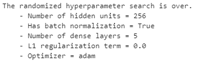

# 1. ***Introducción***
***
En este proyecto se toman datos de transacciones de tarjeta de crédito, donde
el objetivo es identificar si la transacción es o no fraudulenta. Se evidencia
que la base es desbalanceada, donde alrededor del 96% de los datos corresponden
a transacciones no fraudulentas y el resto a transacciones fraudulentas.

**Nota**: el ejercicio del modelo de datos se encuentra en el cuaderno 
`modelo_datos.ipynb`.

Para lograr esto se siguen los siguientes pasos:

1. Validación y exploración de los datos 
2. Preparación de los datos
3. Selección del modelo, mejora y ajuste
4. Presentación de resultados

Dada la flexibilidad de las redes neuronales profundas (DNN) se selecciona este
modelo como base sobre la cual se prueban diferentes arquitecturas,
hiper-parámetros, optimizadores y herramientas para mejorar el entrenamiento del
modelo.

En este documento se presenta un resúmen del proceso realizado. Para una explicación
más detallada, se puede ver el cuaderno `risk_model.ipynb`.

# 2. ***Validación y exploración de los datos***
***
En esta etapa se valida que no hayan valores faltantes dentro de la tabla sobre
la cual se realiza el ejercicio. Posteriormente se revisa que los tipos de datos
de cada columna corresponda a lo esperado dada la naturaleza de cada variable.
Finalmente se valida que los rangos y distribuciones de las variables estén 
dentro de los rangos esperados (*i.e.* se busca valores extraños). 

Con esto hecho, se empiza a hacer análisis de las variables predictivas y la
variable objetivo. El primer hallazgo importante es que se está trabajando con
clases muy desbalanceadas (solo e. 3.74% de las transacciones son fraudulentas).
Esto se puede ver claramente en los siguientes gráficos, que muestran las 
variaciones en las transacciones fraudulentas por diferente variable categórica:

Posteriormente se hace un análisis de las distribuciones de las variables 
predictivas continuas. Se encuentra que estas distribuciones presentan sesgos,
por lo cual en la construcción de la DNN se utilizan capas de `BatchNormalization`, 
que permiten a la red neuronal transformar y aprender qué distribución es más 
adecuada para cada variable de forma que se genere una mejor detección de fraude.

El segundo hallazgo importante es que las transacciones fraudulentas suelen 
utilizar las mismas tarjetas. Esto se ve en el siguiente gráfico, que muestra la
distribución número de transacciones fraudulentas por número de tarjeta de crédito.
Se puede ver que las tarjetas que presentan transacciones fraudulentas por lo 
menos realizan dos transacciones fraudulentas. 

Finalmente se evidencia que la mayoría de casos de fraude ocurren en la costa 
este de Estados Unidos:

Al hacer el análisis de correlación lineal se determina que las variables 
continuas presentan un número bajo de correlación con la variable objetivo y 
entre ellas. Además, las variables de longitud y latidud presentan una correlación
suficientemente alta como para eliminar un par de estas.

# 3. ***Preparación de los datos***
***
Con los *insights* encontrados en la sección anterior, se decide crear un par de
variables nuevas. 

1. `has_fraud`: esta es una variable binaria, que marca aquellos números de 
tarjeta que en el pasado han presentado transacciones fraudulentas.
2. `age`: edad de las personas que realizan la transacción, buscando generar más
variables continuas dados los bajos niveles de correlación con la variable 
objetivo.

A la hora de separar los datos en *train, validation, test*, dado que se está
trabajando con un *dataset* desbalanceado, se utiliza un particionador 
estratificado, de forma que los tres *subset* de datos tengan la misma proporción
de transacciones fraudulentas, evitando así introducir sesgo de muestreo, que 
puede generar resultados engañosos y poco útiles.

Para el *dataset* de entrenamiento se utiliza también un objeto para generar
*over-sampling*  de la clase menos representada. Esto se logra introduciendo 
datos sintéticos, que se crean a partir de las características de la clase 
menos representada en la base de entrenamiento. Con esto se logra tener un 
balance 50-50 para ambas clases. Esto no se utiliza ni para la base de validación
ni para la base de evaluación, dado que estos son los datos con los que se mide
el rendimiento del modelo.

# 4. ***Selección del modelo***
***
Como se explicó en la introducción, se utiliza como modelo base una red neuronal
profunda (DNN), sobre la cual se ajusta la arquitectura utilziando un proceso de
búsqueda aleatoria de combinación de hiper-parámetros (HP):

+ Número de unidades en las capas ocultas
+ Utilización o no de `BatchNormalization` para cada capa
+ Número de capas profundas
+ Optimizador
+ Valor de regularización $l_1$

Además, para evitar *over-fitting* y acelerar el proceso de entrenamiento se utiliza
`EarlyStopping`. 

La mejor combinación de HP encontrada es:

Y la mejor arquitectura de modelo es:

El modelo y sus pesos se encuentran en la carpeta `Models`. Finalmente cabe aclarar
que el entrenamiento del modelo duró cerca de 30 horas, y se utilizó una GPU 
Nvidia Geforce GTX 1060 para este proceso.

# 5. ***Presentación de resultados***
***
Dado que se está trabajando con una base desbalanceada a la hora de evaluar el 
modelo no es suficiente utilizar únicamente la métrica *accuracy*, ya que esta
resulta artificalmente alta por el nivel de desbalance entre clases. Es más,
durante la fase de entrenamiento se evidenció que algunos modelos saltaban entre
colocar o todos 0s o todos 1s. 

Para esto se utilizan métricas complementarias como *AUC, F1-score, precision, 
recall*. Abajo se pueden ver los resultados para *train, test,* y *validation*:

Finalmente, el resultado sobre la base de evaluación (*i.e. test*) de las métricas
complementarias es:

Como se puede ver, los resultados con muy consistentes, no presentan *over-fitting*
y son buenos para ambas clases. Por lo cual se concluye que el modelo presentado
es capaz de realizar adecuadamente la tarea.

## **Posibles mejoras**

Como posibles mejoras a un modelo de este tipo se puede considerar:

1. Utilizar `embeddings` para aprovechar la información de profesiones, que viene
en forma de texto. De esta forma estos `embeddings` pueden se utilziados como
una variable adicional, que tiene la ventaja de poder ser aprendida por la red
neuronal.
2. Aprovechar más la información temporal: podría evaluarce si las transacciones
fraudulentas suelen ocurrir con un bajo intervalo de tiempo entre ellas, y utilizar
esta información para mejorar el modelo.
3. Explorar una arquitectura diferente: se podría evaluar la posibilidad de utilizar
RNN para sacar provecho del componente temporal de las transacciones, y evaluar un
espacio más grande de HP

# 6. ***Documentación***
***
Los archivos principales en este projecto son:
1. `risk_model.py`: cuaderno con la presentación del modelo de detección de fraude
desarrollado.
2. `utils_payu.py`: modulo con funciones y clases utilizadas para la realización del 
proyecto.
3. `modelo_datos.py`: cuaderno con el proceso de creción de modelo de datos y queries
sobre ese modelo de datos.

En la carpeta `i` se encuentran las gráficas realizadas en el proyecto. En la
carpeta `Models` se encuentra el modelo final entrenado para la tarea y que es 
utilizado para la evaluación. En la carpeta `PayU_classifier` se encuentran los
metadatos de todos las iteraciones probadas durante la fase de selección y
entrenamiento del modelo.

# 7. Herramientas y *software* utilizado
***
Las principales librerias utilizadas son:

+ [Tensorflow](https://www.tensorflow.org): v. 2.4.1
+ [Pandas](https://pandas.pydata.org): v.1.1.3
+ [Numpy](https://numpy.org): v.1.19.2
+ [Matplotlib](https://matplotlib.org): v.0.23.2
+ [Scikit-Learn](https://scikit-learn.org/stable/): v.3.3.2

# 8. License
***
This software is licensed under the [MIT](https://opensource.org/licenses/MIT) license. The license can be found in the `license.txt` file. 

